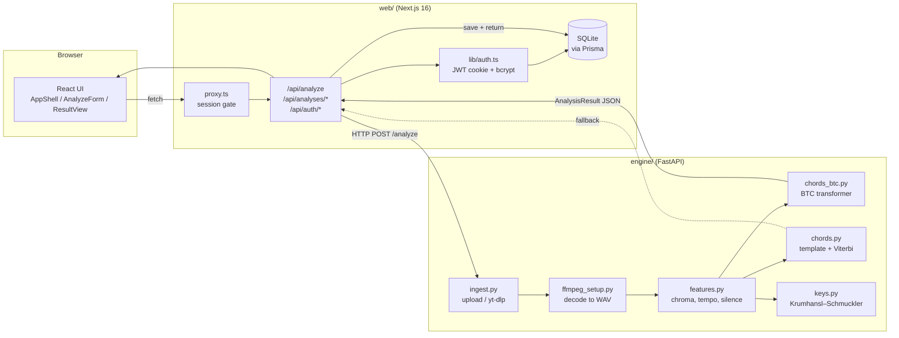

# ChordScribe — Architecture & Roadmap

> Automatic guitar chord recognition from audio and video. Paste a YouTube link
> or upload an MP3/MP4 and get a readable, timestamped chord sheet.
>
> Final Year Project · BSc Computing · Joshua Rhei J. Liao

This document is the engineering overview: how the two halves fit together, what
each module does, the data contract between them, and the planned next features.
For a quick start see the top-level `README.md`; for signal-processing detail see
`engine/README.md`.

---

## 1. What it is

ChordScribe turns a recording into a chord chart a guitarist can actually read:

- **Input** — a YouTube URL, or an uploaded audio/video file (MP3, WAV, M4A,
  FLAC, MP4, WebM…).
- **Output** — estimated key and tempo, a timestamped list of chord segments, a
  proportional timeline, a printable chord sheet, chord-fingering diagrams, and a
  generated fingerpicking tab. Lyrics can be pasted in and kept with the song.
- **Accounts** — email/password (or Google/Facebook/email-OTP), each user's
  conversions saved to their own history.

It is two independently runnable services:

| Service      | Stack                                             | Responsibility |
|--------------|---------------------------------------------------|----------------|
| `web/`       | Next.js 16, React 19, TypeScript, Tailwind 4, Prisma/SQLite | Auth, UI, history, API proxy to the engine, persistence |
| `engine/`    | Python 3.11+, FastAPI, librosa, PyTorch           | Ingest → decode → chord recognition → key/tempo |

The browser only ever talks to the Next.js app. The Next.js app is the only
thing that talks to the engine.

---

## 2. System diagram



---

## 3. Repository layout

```
chord-scribe/
├── README.md                  project overview + local setup
├── docs/
│   └── ARCHITECTURE.md         (this file)
├── engine/
│   ├── app/
│   │   ├── main.py             FastAPI app; /health, /analyze
│   │   ├── ingest.py           URL/upload → local file (yt-dlp)
│   │   ├── ffmpeg_setup.py     find/provision ffmpeg; transcode to WAV
│   │   ├── features.py         audio → chroma, tempo (BPM), silence mask
│   │   ├── chords_btc.py       BTC transformer backend (default)
│   │   ├── chords.py           chroma-template + Viterbi backend (baseline)
│   │   ├── keys.py             key estimation from mean chroma
│   │   ├── pipeline.py         glue: Ingested → AnalysisResult
│   │   ├── config.py           all DSP tunables (AnalysisParams)
│   │   ├── transcribe.py       faster-whisper lyric transcription (/transcribe)
│   │   ├── tab.py              basic-pitch → fretboard → ASCII tab (/tab)
│   │   └── schemas.py          Pydantic response models
│   ├── vendor/btc/             vendored BTC model + weights fetch
│   ├── tests/test_chords.py    matcher unit tests (synthetic chroma)
│   └── requirements*.txt
└── web/
    ├── prisma/schema.prisma    User, OAuthAccount, VerificationCode, Analysis
    ├── proxy.ts                edge session gate (Next 16 "middleware")
    └── src/
        ├── app/
        │   ├── page.tsx        dashboard (server component, auth-gated)
        │   ├── login|register|forgot-password|reset-password/
        │   └── api/
        │       ├── analyze/route.ts        POST: proxy to engine + save
        │       ├── analyses/route.ts       GET list
        │       ├── analyses/[id]/route.ts  GET / PATCH (title, lyrics) / DELETE
        │       ├── auth/…                  register, login, logout, oauth, otp, password
        │       └── health/route.ts
        ├── components/
        │   ├── AppShell.tsx     top-level client state (active analysis, sidebar)
        │   ├── AnalyzeForm.tsx  YouTube / Upload tabs
        │   ├── ResultView.tsx   the whole result screen + playing tools
        │   ├── ChordTimeline.tsx  proportional chord bar
        │   ├── ChordChart.tsx     printed chord sheet
        │   ├── ChordTab.tsx       generated fingerpicking tab
        │   ├── ChordDiagram.tsx   SVG chord box (tuning-aware)
        │   ├── ChordName.tsx      label that reveals a diagram on hover/tap
        │   ├── LyricsView.tsx     chords laid out over the lyrics + adjust mode
        │   ├── LyricsEditor.tsx   plain textarea for the lyrics
        │   ├── TuningContext.tsx  provides the active Tuning to the chord views
        │   ├── MediaPlayer.tsx    YouTube IFrame API / local <audio>/<video>
        │   └── Sidebar.tsx / Topbar.tsx
        └── lib/
            ├── types.ts        ⟷ engine/app/schemas.py  (keep in sync)
            ├── engine.ts       HTTP client for the Python service
            ├── analyses.ts     Prisma read/write for saved analyses
            ├── auth.ts         JWT session cookie, bcrypt helpers
            ├── music.ts        transpose + capo suggestion
            ├── tuning.ts       tuning presets + custom-spec parsing + string target freqs
            ├── pitch.ts        MPM pitch detection for the mic tuner
            ├── chordShapes.ts  guitar fingerings (tuning-aware) + fingerpick-tab generator
            └── format.ts       time formatting, segment merging
```

---

## 4. Web app (`web/`)

### 4.1 Routing & rendering

- **Next.js 16** with the App Router. `web/AGENTS.md` warns that this version has
  breaking changes vs. older Next — consult `node_modules/next/dist/docs/` before
  touching framework APIs.
- `src/app/page.tsx` is a **server component**: it calls `getCurrentUser()`,
  redirects to `/login` if absent, otherwise loads the user's analysis list and
  renders `<AppShell>` (a client component that owns all interactive state).
- `proxy.ts` is the edge gate (Next 16's renamed middleware). It only checks for
  the *presence* of the session cookie — real verification happens server-side in
  `getCurrentUser()`. It bounces guests away from private pages and signed-in
  users away from `/login` and `/register`. API routes are excluded from the
  matcher and do their own auth, returning JSON 401s.

### 4.2 Auth (`src/lib/auth.ts`, `src/app/api/auth/*`)

- Email + password. Passwords are **bcrypt**-hashed (`bcryptjs`, cost 10).
- Session is a **signed JWT** (`jose`, HS256, `sub = userId`) stored in an
  `httpOnly`, `sameSite=lax` cookie; `secure` in production. Lifetime
  `SESSION_DAYS`.
- `getCurrentUser()` is wrapped in React `cache()` so it runs once per request.
- Also supported: Google/Facebook OAuth (`arctic`), email-OTP login, and
  password reset — all via one-time codes in the `VerificationCode` table
  (only the SHA-256 hash of each code/token is stored).
- Bot protection: Cloudflare **Turnstile** on register (blank keys → Cloudflare
  test keys that always pass, for local dev).
- Dev email: blank SMTP → **Ethereal** preview; the preview URL is printed to the
  console and surfaced in the UI (`DevPreviewLink`).

### 4.3 Data (`prisma/schema.prisma`)

SQLite file at `web/prisma/dev.db` (via `DATABASE_URL` in `web/.env`). Models:

- **User** — `email` (unique), `name`, `password?` (null for OAuth-only),
  `image?`, `emailVerified?`, `termsAgreedAt?`.
- **OAuthAccount** — `(provider, providerAccountId)` unique, cascades on user
  delete.
- **VerificationCode** — `identifier` (email), `tokenHash`, `purpose`
  (`email-otp` | `password-reset`), `attempts`, `expiresAt`.
- **Analysis** — `title`, `sourceKind`, `sourceRef`, `durationSec`, `bpm?`,
  `musicalKey?`, `lyrics?`, and `result` (the full `AnalysisResult` serialised as
  JSON). Indexed by `(userId, createdAt)`.

`title` is the single source of truth for the display name — it can be renamed
after the fact, independent of the original media title captured in `result`.

### 4.4 Result screen (`ResultView.tsx`)

Client-side, entirely derived from the saved `AnalysisResult` — no re-analysis.
The "playing tools" the user can adjust live:

| Tool          | State           | Effect |
|---------------|-----------------|--------|
| Transpose     | `−11…+11`        | shifts every chord label + key (`music.ts::transposeChord`) |
| Capo          | `0…9`            | subtracts from the shown *shapes* (`offset = transpose − capo`) |
| Tuning        | preset / custom | re-fingers diagrams + tab for the tuning (`tuning.ts`); **persisted** |
| Prefer ♭      | boolean         | sharp vs. flat spelling |
| Auto-scroll   | boolean + speed | rAF scroll of the nearest scroll parent, stops on user scroll |
| View          | `chords \| lyrics \| tab` | chord sheet · chords-over-lyrics · fingerpicking tab |
| Capo suggest  | derived         | `suggestCapo()` finds the fret giving the most open shapes (standard tuning only) |

`tuning`, `lyrics`, `lyricAlignment`, `lyricWords`, and `tab` are saved back to
the `Analysis` row through `PATCH /api/analyses/[id]` as they change.

`MediaPlayer` reports playback position (`positionSec`); the timeline and chord
sheet highlight the current chord and clicking a chord tile seeks the player
(`seekRef`).

**Chord fingerings** (`ChordName.tsx`): hovering or focusing a chord label pops a
fixed-position card (viewport-aware, flips above / clamps to the edge) with the
primary shape; clicking opens a popover with **every common voicing** — the open
shape plus the movable E-shape and A-shape barres from
`chordShapes.ts::getChordShapes` — captioned with the shape name and fret. Esc,
an outside click, or a second click on the label dismiss it. Non-standard tunings
show the single adapted shape.

**Layout** (`AppShell.tsx`): the sidebar is a width-collapsing in-flow column on
desktop and a slide-over drawer on mobile, toggled from the topbar's animated
hamburger↔✕ button. `sidebarOpen` is derived — `override ?? isDesktop` — so it
follows the viewport (`useSyncExternalStore` on a media query, no hydration
mismatch) until the user makes a choice. The result view widens to `max-w-6xl`
(the analyse form stays `max-w-2xl`) and the chord sheet grid goes up to six
columns on `xl`.

**Guitar tuner** (`TunerButton.tsx` in the topbar → `GuitarTuner.tsx`): a mic
tuner. `getUserMedia` with `echoCancellation`/`noiseSuppression`/`autoGainControl`
all **off** (browser DSP shifts pitch) → an `AnalyserNode` → a per-frame loop
running `lib/pitch.ts::detectPitch`, the **McLeod Pitch Method** (normalised
square-difference function, pick the first peak clearing 87 % of the tallest —
avoids the octave errors bare autocorrelation makes on a harmonic-rich string).
Readings are median-smoothed and snapped to the nearest string of the chosen
tuning (`tuning.ts::stringTargets`, with ±1-octave tolerance). Synthetic tests
put it under 1 cent across the whole guitar range (82–330 Hz). A string held in
tune for a few frames latches green (letter, ✓, and all) and stays so you can
see which strings are still to do; it resets on a tuning change or "reset".
Permission denied / insecure-context / no-device states are handled with a retry.

The **Tab** view (`ChordTab.tsx`) is transcribed from the audio and **guided by
the detected chords**: a **Transcribe tab from audio** button hits
`/api/analyses/[id]/tab` → engine `/tab`, passing the analysis's chord segments.
`tab.py` then:
1. runs **basic-pitch** polyphonic note transcription (the real pitches played);
2. prunes each strum — overtones, and quiet notes that aren't in the chord under
   that beat (usually vocal / other-instrument bleed);
3. writes a strum of the detected chord as **that chord's grip** (open shape or
   barre), and frets a lead line near the chord's hand position — a beam search
   keeps the fretting hand from jumping around;
4. renders timed ASCII tab on a sixteenth-note grid (bar lines from the BPM).

Saved as `tab` (JSON `{ ascii, tuning, noteCount }`); changing the tuning prompts
a re-transcribe. Accurate on clean recordings, noisier on a full band mix. (The
old generic `chordsToFingerpickTab` stays in the tree, unused.)

### 4.5 Music theory helpers

- **`music.ts`** — `parseChord` handles any `A–G` root + `#`/`b` + arbitrary
  suffix, so transposition is safe if the vocabulary grows beyond maj/min.
  `suggestCapo` scores each fret `0–7` by open-shape count minus `fret/3`, and
  only suggests a non-zero capo if it beats open position outright.
- **`chordShapes.ts`** — `getChordShapes(label, tuning)` returns every voicing
  worth showing, easiest first. In **standard tuning**: the hard-coded open shape
  (C, A, G, E, D, Am, Em, Dm) if one exists, then the movable E-shape and
  A-shape barres computed from the root pitch class. `getChordShape` is just
  `getChordShapes(...)[0]`. For **other tunings** a single shape is *adapted*
  from the standard one: a uniform retune (E♭, D) keeps the same fingering, and a
  partial retune (Drop D, DADGAD, Open G…) keeps the unchanged strings and
  re-frets each moved string to the nearest chord tone (or mutes it).
  `chordsToFingerpickTab` renders a rolling bass-and-arpeggio pattern per chord
  as ASCII tab, with the tuning's string names as row labels.
- **`tuning.ts`** — 8 tuning presets plus a `"c,g,c,f,a,d"` custom-spec parser;
  `resolveTuning()` maps a stored value (preset id / custom spec / null) to a
  `Tuning` (open pitch classes + row labels). `TuningContext` carries the active
  tuning to `ChordDiagram` / `ChordTab` without prop-drilling through
  `ChordName`.

---

## 5. Engine (`engine/`)

### 5.1 Endpoints (`app/main.py`)

| Method | Path         | Body                                        | Returns |
|--------|--------------|---------------------------------------------|---------|
| GET    | `/health`    | —                                           | `{ ok, version }` |
| POST   | `/analyze`   | `multipart` (`file`) or JSON (`youtube_url`) | `AnalysisResult` |
| POST   | `/transcribe`| same as `/analyze`                          | `TranscriptionResult` (`{ text, words:[{t,w}], language }`) |
| POST   | `/tab`       | same as `/analyze` + `tuning`, `bpm`, `chords` | `TabResult` (`{ ascii, note_count, bpm }`) |

CORS is limited to `http://localhost:3000`. Uploads are capped at 200 MB. Each
request gets a temp workdir that is deleted in a `finally` block. All three
endpoints share `_ingest_from_request()` for the URL/upload handling.

`/transcribe` (`app/transcribe.py`) runs **faster-whisper** (`base` model,
int8 CPU, `WHISPER_MODEL` to override) over the decoded audio with
`word_timestamps=True` and no VAD (it drops sung audio). Opt-in from the UI only
— slow (~0.3–0.6× realtime), ~145 MB first-run download. 501 if not installed.

`/tab` (`app/tab.py`) runs **basic-pitch** (bundled ONNX model) for polyphonic
note transcription, prunes non-chord bleed using the passed `chords`, writes
strums as the chord's grip and lead lines as their notes, then a beam-search
fretboard assignment and a sixteenth-note-grid ASCII renderer. Opt-in,
~0.05× realtime. 501 if not installed.

### 5.2 Pipeline (`app/pipeline.py`)

1. **Ingest** (`ingest.py`) — save the upload, or `yt-dlp` `bestaudio` → WAV.
   `yt-dlp` is configured to use Node as its JS runtime for YouTube's
   signature/PO-token challenges.
2. **Decode** (`ffmpeg_setup.py`) — `ensure_readable()` hands both backends a
   file `soundfile` can read; MP4/MOV/WEBM and awkward MP3s are transcoded to
   WAV. If no system ffmpeg is on PATH, a static build (`imageio-ffmpeg`) is
   provisioned into `engine/bin/` on first run — no admin rights.
3. **Features** (`features.py`) — load mono at 22 050 Hz, estimate tuning
   (real recordings drift from A440), harmonic-percussive separation, then
   **CQT chroma** at 36 bins/octave. Optional **beat-synchronous** aggregation
   (median per beat) and `librosa` beat tracking for BPM. Per-frame RMS gives a
   **relative** silence mask (quiet vs. *this track's* 90th-percentile RMS).
4. **Chords** — one of two backends, selected by `CHORD_BACKEND` /
   `AnalysisParams.chord_backend`:
   - **`btc`** (default) — **BTC**, a pretrained bi-directional transformer for
     chord recognition (Park et al., ISMIR 2019), vendored in `vendor/btc/`.
     Uses the **maj/min** model (25 labels) matching the app's vocabulary.
     ~12 MB weights auto-download on first use. Inference ≈ 2–5 s for a
     5-minute song on CPU. **If BTC throws, the pipeline logs and falls back to
     the template backend** rather than failing the request.
   - **`template`** — chroma → 24 binary maj/min triad templates → cosine
     similarity → softmax emission → **Viterbi** smoothing → segment merge.
     Kept for comparison / offline use (no Torch).
5. **Key & tempo** (`keys.py`) — Krumhansl–Schmuckler probe-tone profiles
   correlated against the mean chroma; BPM from step 3. Run for both backends.

Sub-1 s chord slivers are merged into a neighbour either way
(`merge_short_segments`). All tunables are echoed back in
`engine.params` for reproducible evaluation.

### 5.3 Configuration (`app/config.py`)

`AnalysisParams` is a frozen dataclass — the single place for every DSP knob
(`sample_rate`, `hop_length`, `emission_temperature`, `transition_penalty`,
`silence_rms`, `min_segment_sec`, `beat_sync`, `chord_backend`). `transition_penalty`
is deliberately **1.5**: past ~2.0 the Viterbi decoder can freeze onto one label
for minutes on dense full-band mixes — see `engine/README.md` → Accuracy notes.

---

## 6. The data contract

`web/src/lib/types.ts` and `engine/app/schemas.py` describe the **same** JSON and
must be kept in sync by hand.

```ts
interface AnalysisResult {
  source: { kind: "upload" | "youtube"; reference: string; title?: string; durationSec: number };
  bpm?: number;
  key?: string;                       // e.g. "C major"
  segments: {                         // ordered, non-overlapping
    start: number; end: number;       // seconds
    label: string;                    // "C", "Am", … or "N" (no chord)
    confidence: number;               // [0, 1]
  }[];
  engine: { version: string; method: string; params: Record<string, number | string | boolean> };
}
```

The web layer extends this on save into `SavedAnalysis` — adding `id`,
`createdAt`, and the user-editable `lyrics`, `lyricAlignment`
(`{ placements: { t, line, ch }[] }`, keyed by segment start time), and `tuning`
(preset id / custom spec / null). The engine currently only ever emits
**major/minor triads and `N`** — `music.ts` and `chordShapes.ts` are written to
tolerate richer labels if that changes (see roadmap).

### Request lifecycle (`/api/analyze`)

```
AnalyzeForm ──POST /api/analyze──▶ route.ts
   route.ts: getCurrentUser() → 401 if none
   route.ts: ENGINE_MOCK? → MOCK_RESULT
             else → engine.ts → POST {ENGINE_URL}/analyze
   engine: pipeline.analyze() → AnalysisResult
   route.ts: saveAnalysis(userId, result) → Prisma row
   route.ts ──▶ SavedAnalysis ──▶ AppShell.handleResult() → ResultView
```

`ENGINE_MOCK=1` in `web/.env.local` bypasses the Python service entirely and
returns `web/src/lib/mock.ts` — useful for UI work.

---

## 7. Running locally

Two terminals. Full instructions in the top-level `README.md`; summary:

```bash
# 1. engine
cd engine && python -m venv .venv && . .venv/Scripts/activate   # (Windows)
pip install -r requirements-dev.txt
uvicorn app.main:app --reload --port 8000

# 2. web
cd web
cp .env.example .env.local          # set AUTH_SECRET
echo 'DATABASE_URL="file:./dev.db"' > .env
npm install
npx prisma migrate dev
npm run dev                          # http://localhost:3000
```

Current dev state on this machine: both `.venv` and `node_modules` are installed,
`.env`/`.env.local` exist, and `prisma/dev.db` is migrated. It holds a few test
accounts; `josh@test.com` has a known dev password (`chordscribe123`). Otherwise
register a new account — Turnstile uses always-pass test keys and there is no
email-verification gate.

---

## 8. Testing & evaluation

- **Engine:** `pytest` (matcher unit tests on synthetic chroma, no audio needed),
  `ruff check .`.
- **Web:** `npm run lint`. No automated component/e2e tests yet (see roadmap).
- **Chord accuracy (proposal objective 3):** the template backend emits
  MIREX-style `maj/min` labels; score against reference `.lab` files with
  `mir_eval.chord.evaluate` (gives WCSR). Recipe in `engine/README.md`.

---

## 9. Known limitations

| Area | Limitation |
|------|------------|
| Chord vocabulary | maj/min triads + `N` only — no 7ths, sus, dim, aug, slash chords. The BTC large-vocab (170-label) model is vendored but unused pending frontend support. |
| Major/minor on thin voicings | Power-chord-style arrangements (root+fifth, weak third) give little evidence to tell e.g. Am from A. Inherent to chroma methods. |
| Lyrics transcription | Whisper `base` on sung, non-English, full-band audio is rough — a starting draft to correct, not a finished transcript. `WHISPER_MODEL=small` helps noticeably. |
| Non-standard tuning shapes | Adapted from the standard shape, not a real per-tuning chord dictionary — fine for the common tunings, occasionally an awkward voicing for the exotic ones. |
| Beat/downbeat | BPM only; no bar lines or time-signature detection, so the chord sheet isn't barred. |
| Tests | No web-side automated tests; engine tests don't cover the BTC path or real audio. |
| Deploy | Local-dev only (SQLite, localhost CORS, dev secrets). No production config. |

---

## 10. Roadmap

### ✅ Done — Lyrical chord sheet (new "Lyrics" view)

Shipped. `ResultView` now has a three-way toggle **Chords · Lyrics · Tab**; the
Lyrics view (`LyricsView.tsx`) shows the pasted lyrics with chord symbols above
the words, monospace:

```
        G                 D                Em            C
Well I  don't know why    you say good-    bye,  I say   hello
```

- **Alignment**, in priority order per chord: (1) a manual placement the user
  set; (2) **Whisper word timing** — if the lyrics were transcribed, each chord
  lands above the word being sung when it starts, and a chord that plays while
  nobody is singing (before the first word, after the last, or in a gap > 6 s)
  goes on its own `(intro)` / `(instrumental)` / `(outro)` row with no words;
  (3) fallback — each line gets a slice of the track proportional to its length
  and the chord drops at the matching character offset.
- **Adjust chords** mode lets the user click a chord then click the word it
  belongs over; placements are stored as `lyricAlignment` (`{ t, line, ch }[]`,
  keyed by segment start time so they survive transpose). **Reset alignment**
  clears them.
- **Editing.** `LyricsEditor.tsx` (a plain textarea) is folded into the view —
  the old standalone `<Lyrics>` block and `Lyrics.tsx` are gone.
- Chords track transpose/capo/tuning like every other view.

### ✅ Done — Lyric transcription (Whisper)

Shipped. The Lyrics view has a **Transcribe from audio** button (YouTube sources
transcribe straight from the saved video id; upload sources ask for the file
again since it's never stored server-side). It POSTs to
`/api/analyses/[id]/transcribe` → engine `/transcribe` → faster-whisper. The
draft lands in the editor for the user to correct; on save, `lyrics` and the
`lyricWords` (`[{t,w}]`) timings persist together, and the Lyrics view switches
to word-accurate chord placement. Clearing the lyrics clears the timings.

**Follow-ups:** a "force language" option; optional Demucs vocal isolation before
Whisper for cleaner results on dense mixes; drag-to-position; a print stylesheet.

### ✅ Done — Alternate tuning support

Shipped. A **Tuning** dropdown sits next to Transpose/Capo with 8 presets
(Standard, Drop D, Drop C, E♭, D, DADGAD, Open G, Open D) plus custom specs;
the choice is persisted per analysis (`tuning`). Chord **diagrams**
(`ChordDiagram.tsx`) and the **fingerpicking tab** (`ChordTab.tsx`) re-finger
for the tuning via `lib/tuning.ts` + the adapt logic in `chordShapes.ts`; the
engine is untouched (chroma is tuning-agnostic). Capo suggestions are hidden for
non-standard tunings. `TuningContext` provides the active tuning to the nested
diagram components.

**Follow-ups:** a real per-tuning chord dictionary for the exotic tunings; a
"detect tuning from the audio" suggestion (lowest sustained pitch class vs.
standard).

### Larger chord vocabulary

Switch the BTC backend to the vendored **170-label** model (7ths, sus, dim, aug,
slash). Requires teaching `music.ts` (`parseChord` already keeps suffixes, but
`transposeChord` spelling and key logic need checking) and `chordShapes.ts`
(shapes for the new qualities) those chords. `engine/README.md` flags this as the
main follow-up.

### Barred chord sheet

Use the beat track (already computed) plus a downbeat/time-signature estimate to
group chords into bars and render the chord sheet with bar lines — much closer to
a real lead sheet.

### Better major/minor on thin voicings

Implement NNLS chroma (Mauch & Dixon, 2010) in the template backend to remove the
"5th harmonic reads as a major third" artifact. Research task, template-backend
only.

### Web test coverage

Add Vitest + Testing Library for `music.ts` / `chordShapes.ts` / `format.ts`
(pure, high-value) and a Playwright smoke test for the analyse→result flow with
`ENGINE_MOCK=1`.

### Production deployment

Postgres instead of SQLite, real OAuth/SMTP/Turnstile keys, engine on a
CPU-inference host, `ENGINE_URL` over TLS, secret management, rate limiting on
`/api/analyze`.

---

## 11. Conventions

- **Keep `types.ts` ⟷ `schemas.py` in sync** whenever the analysis shape changes.
- **Engine params** belong in `config.py::AnalysisParams` (echoed to the client),
  never inline literals.
- **Next 16 APIs** — check `node_modules/next/dist/docs/` first (`web/AGENTS.md`).
  The agent-notice block at the top of `web/AGENTS.md` is regenerated by
  `next dev`; commit it with your work to keep the tree clean.
- **New persisted fields** on `Analysis` go through
  `PATCH /api/analyses/[id]` + `lib/analyses.ts` + a Prisma migration.
